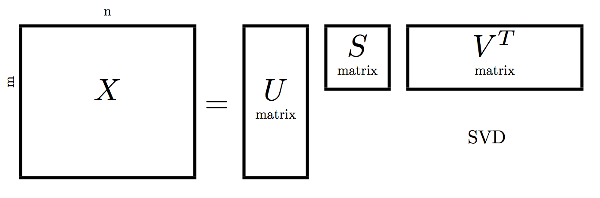

基本线性代数和矩阵
===

## 一个问题

Fibonacci 数列满足公式 $$F_{n} = F_{n-1} + F_{n-2}$$ ，这个数列的前几项是

```
0, 1, 1, 2, 3, 5, 8, 13, 21, 34, 55, 89, 144, 233, 377, 610, 987, 1597 ...
```

计算比如第100项 $$F_{100}$$ 是一个常见递归编程题，各位白帽子基本上都会做，也知道通过某些技巧避免无效计算。可是各位有没有考虑过直接计算 $$F_{100}$$ 的非递归方式呢？

其实白帽子朋友们可能更疑惑的是，这个不是一个编程问题么，它和线性代数及矩阵有什么关系？

这一节我会简单谈谈线性方程然后引入矩阵的概念，并从数据科学的角度以整块数据操作来介绍和理解矩阵，以几个数据模型的例子介绍矩阵的用法。

## 线性方程和方程组

### 线性的意义
一个最简单的线性方程看起来是这样的，这里 $$a$$ $$b$$ 是常量，$$x$$ $$y$$是变量：
$$
\begin{array}{lcl} a\cdot x + b = y \end{array}
$$

线性方程的意义在于所有变量的关系都是一次方，即使有 $$n$$ 个不同的变量 $$x$$ 比如：
$$
\begin{array}{} a_0x_0+a_1x_1+a_2x_2+ ... + a_{n-1}x_{n-1} & = & y\end{array}
$$

这个方程有个简单的写法，用了 $$\sum$$ 符号和上下标表示求和：
$$
\begin{array}{} \sum_{i=0}^{n-1}a_ix_i & = & y\end{array}
$$

如果用向量化的语言表示，$$y$$ 就是 $$a$$ 和 $$x$$ 的点积，写做 $$y = a\cdot x$$。

不仅 $$x$$ 可以很多，$$y$$ 也可以很多，这个线性方程就成了方程组，比如是这样（简化起见去掉了常数项）：
$$
\begin{array}{} 
a_{00}x_0+a_{01}x_1+a_{02}x_2+ ... + a_{0,n-1}x_{n-1} & = & y_0 \\
a_{10}x_0+a_{11}x_1+a_{12}x_2+ ... + a_{1,n-1}x_{n-1} & = & y_1 \\
a_{20}x_0+a_{21}x_1+a_{22}x_2+ ... + a_{2,n-1}x_{n-1} & = & y_2 \\
...\\
a_{m-1,0}x_0+a_{m-1,1}x_1+a_{m-1,2}x_2+ ... + a_{m-1,n-1}x_{n-1} & = & y_{n-1} \\
\end{array}
$$

这样的方程组也有一种更加清晰的写法，比如：
$$
\begin{bmatrix} 
a_{00} & a_{01} & \cdots & a_{0,n-1}\\
a_{10} & a_{11} & \cdots & a_{1,n-1}
\\ \vdots & \ddots & & \vdots 
\\ a_{m-1,0} & a_{m-1,1} & \cdots & a_{m-1,n-1}
\end{bmatrix} 
\times 
\begin{bmatrix}  x_0 \\ x_1 \\ \vdots \\ x_{n-1} \end{bmatrix}
= \begin{bmatrix}  y_0 \\ y_1 \\ \vdots \\ y_{n-1} \end{bmatrix}
$$

在这里，我们可以定义 $$A$$ 等于

$$
A =
\begin{bmatrix} 
a_{00} & a_{01} & \cdots & a_{0,n-1}\\
a_{10} & a_{11} & \cdots & a_{1,n-1}
\\ \vdots & \ddots & & \vdots 
\\ a_{m-1,0} & a_{m-1,1} & \cdots & a_{m-1,n-1}
\end{bmatrix} 
$$
同样的定义 $$X$$ 和 $$Y$$ ，这样，这个看似复杂的方程组就可以写成

$$
AX = Y
$$

这就是常见的线性代数的表达方式。这里 $$A$$ , $$X$$ 和 $$Y$$ 称为矩阵。如果把矩阵表达方式还原为线性方程组，只需要把 $$A$$ 的每一行和 $$X$$ 相乘就得到 $$Y$$ 每一行的值，比如：

$$
\begin{bmatrix} 
a_{00} & a_{01} & \cdots & a_{0,n-1}
\end{bmatrix} 
\times 
\begin{bmatrix}  x_0 \\ x_1 \\ \vdots \\ x_{n-1} \end{bmatrix} = a_{00}x_0+a_{01}x_1+a_{02}x_2+ ... + a_{0,n-1}x_{n-1}
$$

###练习题

$$
\begin{bmatrix} 
1 & 2 & 3 & 4\\
3 & 2 & 6 & 3\\
9 & 5 & 3 & 2\\
2 & 2 & 3 & 3
\end{bmatrix} 
\times 
\begin{bmatrix}  x_0 \\ x_1 \\ x_2 \\ x_3 \end{bmatrix}
= \begin{bmatrix}  y_0 \\ y_1 \\ y_2 \\ y_3 \end{bmatrix}
$$

当 $$X$$ 取值为如下时，$$Y$$ 矩阵是什么？
$$
\begin{bmatrix}  7 \\ 4 \\ 7 \\ 2 \end{bmatrix}
$$

可以手工计算，也可以写`python`程序计算。

白帽子朋友们也可以思考一下这个问题的逆问题：如果已知 $$Y$$ 和 $$A$$ ，怎么求 $$X$$ 呢？由 $$A$$ $$X$$ 求 $$Y$$ 很直接但是从 $$A$$ 和 $$Y$$ 求 $$X$$ 是一个比较难的问题，请在深入阅读部分继续探索线性代数的其他内容之后自行得到答案。
## 矩阵
矩阵就是一个 $$m\times n$$ 个元素的方阵，比如这就是一个 $$2\times2$$ 的矩阵：
$$
\begin{bmatrix} x_{11} & x_{12} \\ x_{21} & x_{22} \end{bmatrix}
$$

我们由线性方程组引入矩阵，矩阵也可以还原成线性方程组，但是从这里开始请把矩阵想象成一个有着内在结构的整体，尽量不要拆散它。

有好奇白帽子朋友就会问，矩阵能是立体的或者更多维度么？那个叫做张量（“Tensor”），也有自己一套有趣的数学方法，请自行学习在此不做更多表述。

## 矩阵的常见计算
对于白帽子的数据科学工作来说，常见矩阵计算里比较重要的是矩阵乘法和矩阵分解。

### 矩阵乘法

先看一个 $$2\times3$$ 矩阵和 $$3\times4$$ 矩阵相乘得到 $$2\times4$$ 矩阵的例子：

$$
\begin{bmatrix} x_{11} & x_{12} & x_{13} \\ x_{21} & x_{22} & x_{23} \end{bmatrix}
\times
\begin{bmatrix} y_{11} & y_{12} & y_{13} & y_{14} \\
				y_{21} & y_{22} & y_{23} & y_{24}\\
				y_{31} & y_{32} & y_{33} & y_{34} 
\end{bmatrix} = 
\begin{bmatrix} z_{11} & z_{12} & z_{13} & z_{14} \\ z_{21} & z_{22} & z_{23} & z_{24} 
\end{bmatrix}
$$

其中 $$z_{23} = x_{21}\cdot y_{13}+x_{22} \cdot y_{23} + x_{23}\cdot y_{33}$$ 其他项目类推。从这个例子我们可以快速观察学习到矩阵乘法应该是：

* 矩阵乘法遵循 $$z_{ij}=\sum_{k}x_{ik}y_{kj}$$。我个人更喜欢以直观的向量化形式表达出来，就是左边每一行乘以右边每一列然后填充到对应位置，也就是 $$z_{ij} = x_{i} \cdot y_{j}$$。
* $$m\times n$$ 和 $$n\times k$$ 相乘的到 $$m\times k$$ 矩阵，并且只有在左边矩阵的列数 $$n$$ 和右边矩阵的行数 $$n$$ 一致是才可以相乘。
* 矩阵乘法满足结合律，也就是说 $$A(BC)=(AB)C$$，这一性质对很多算法包括矩阵的并行算法有重要意义。矩阵也可以分块相乘，在这里不赘述请自行学习。思考题：既然说了结合律，矩阵乘法是不是满足交换律呢？思考一下，参见上一条。

#### 练习题

为了克服初学时容易沉迷于每一项的计算而忽略矩阵作为一个整体的意义，请作如下两个练习，并且在今后忘记矩阵乘法时反复回想这个例子：

$$
\begin{bmatrix} 5 & 3 & 2 & 1\end{bmatrix} \times 
\begin{bmatrix} 5 \\ 3 \\ 2 \\ 1\end{bmatrix} = ?
$$

$$
\begin{bmatrix} 5 \\ 3 \\ 2 \\ 1\end{bmatrix} \times 
\begin{bmatrix} 5 & 3 & 2 & 1\end{bmatrix} 
= ?
$$

第一个例子答案是一个 $$1\times 1$$ 的矩阵，第二个例子答案是一个 $$4\times 4$$ 的矩阵。

### 矩阵分解

矩阵分解可以想象为矩阵相乘反过来，比如由一个已知 $$m\times n$$ 矩阵 $$C$$ 求一个$$m\times k$$ 的矩阵 $$A$$ 和 $$k\times n$$ 的矩阵 $$B$$ 满足 $$C \sim A\times B$$ 其中 $$\sim$$ 代表“近似等于”。矩阵分解常常要求分解结果的矩阵（$$A$$ 和 $$B$$）满足一定形式，比如是对角、上三角等等，并以这种特定形式满足计算或者某种数据表达。

数据科学里比较常用的分解方式有 [SVD 奇异值分解](https://zh.wikipedia.org/wiki/奇异值分解)，[PCA 主成分分析](https://zh.wikipedia.org/wiki/主成分分析)等。以 SVD 举例来说，它要寻找三个矩阵 $$U$$ $$S$$ $$V$$ 并满足 $$X = USV^\mathrm{T}$$（这里的上角标 $$\mathrm{T}$$ 代表[矩阵的转置](https://zh.wikipedia.org/zh-hans/转置矩阵)也就是矩阵行列对换位置）。实际工作中 $$S$$ 常是一个小的正方形矩阵，$$U$$ 是瘦高 $$V^\mathrm{T}$$ 是扁平：




其中 $$S$$ 矩阵对角线保留的维度越多，$$USV^\mathrm{T}$$ 就越接近原始矩阵 $$X$$ （思考题：这是为什么？请前往[SVD 奇异值分解](https://zh.wikipedia.org/wiki/奇异值分解)了解奇异值的意义）。矩阵分解的具体计算是个比较困难的数值优化问题，已有很多开源高效实现，这里就不赘述。

####练习题

找一个手工或者编程能做的矩阵分解题比较困难，暂时TBD，或者用[SVD 奇异值分解](https://zh.wikipedia.org/wiki/奇异值分解)的wiki页面例子代替。
## 矩阵的意义
数据科学中单个数据点的意义十分有限，有意思的都是数据的组合。线性代数入门时一个常见误解在于总是把矩阵理解成一系列分散等式的堆叠并迷失在计算数值本身，这样会失去了矩阵作为一个有内在结构的一块数据的意义。矩阵的意义在于把整块数据进行组合操作：它可以为复杂操作建立数据模型并转换成计算，并可以通过矩阵分解等操作表达数据模型里抽象的特征。
### Fibonacci 数列问题：矩阵乘法
矩阵对于数据的意义是把“动作”和“操作”这些行为建立模型并变得可以计算，这样数据和操作就可以轻松结合。比如说求 Fibonacci 特定项的这个递归操作可以转换成矩阵乘法的序列，从而可以用计算机简单的编码完成复杂的操作。

如果定义
$$
U_n = \begin{bmatrix} F_{n+1} \\ F_n \end{bmatrix}
$$

那么把 Fibonacci 数列的公式 $$F_{n} = F_{n-1} + F_{n-2}$$ 表达成矩阵方式只需要定义 $$A = \begin{pmatrix}1&1\\1&0\end{pmatrix}$$  然后 $$U_n = A\times U_{n-1}$$ 就等价于 $$F_{n} = F_{n-1} + F_{n-2}$$ 。这样矩阵表达方式的好处在于把 $$F_{n}$$ 求值的递归公式表述成如下矩阵 $$A$$ 的 $$n$$ 次方：

$$
\begin{pmatrix}1&1\\1&0\end{pmatrix}^n=\begin{pmatrix}F_{n+1}&F_n\\F_n&F_{n-1}\end{pmatrix}
$$

这样一个复杂的递归问题变成了一个简单矩阵循环自己乘自己 $$n$$ 次即可，编码难度极度降低。其实也不需要循环 $$n$$ 次：这个 Fibonacci 数列矩阵称之为 Fibonacci Q-Matrix，它的计算方法类似于求一个数的 $$n$$ 次方，可以方便的在 $$\mathrm{O}(\log n)$$ 时间复杂度完成，参见[这个`python`代码范例](https://gist.github.com/iurisilvio/1259701)。思考题：为什么这里循环 $$n$$ 次可以通过分治法变成 $$\mathrm{O}(\log n)$$ 时间复杂度？思考一下矩阵乘法结合律。

#### 其他矩阵乘法的例子
利用矩阵可以把操作变成数据模型计算的方法，同样的方法应用到神经网络的求解计算，比如现在最火热的话题“深度学习”里面的神经网络自动求导，它其实就是利用矩阵乘法表达了求导的链式规则，把每一层的值和导数放在同一个矩阵里，经过矩阵的多次乘法既传播了神经元的值也同时完成了求导的链式规则，用矩阵乘法大大简化了编码复杂度。关于神经网络的相关知识，后面的机器学习部分会提到。

更多的矩阵计算表述操作的例子还有，如果白帽子朋友做过图像处理也会知道，图像的旋转和缩放等操作可以通过乘以相应矩阵完成；魔方的还原也可以[通过矩阵乘法操作完成](http://web.mit.edu/sp.268/www/rubik.pdf)；一些移位和替换类的加密解密操作[也是通过矩阵乘法完成](http://aix1.uottawa.ca/~jkhoury/cryptography.htm)。矩阵的乘法满足结合律也可以分块并行执行，这为矩阵的快速并行计算和 GPU 运算奠定基础。这些性质请各位白帽子自行阅读探索。

#### 复习一个知识点：求导的链式规则

如果一个函数 $$f$$ 是对 $$y$$ 的函数写成 $$f(y)$$ ，而 $$y$$ 是对 $$x$$ 的函数，那么 $$f(y)$$ 对于 $$x$$ 的导数可以先对 $$y$$ 求导再乘以 $$y$$ 对 $$x$$ 求导即可，称之为“链式规则”：

$$
\frac{d}{dx}[ {f(y)} ] = \frac{d}{dy}[f(y)] \frac{dy}{dx}
$$

对于多层的函数嵌套，只需要每一层乘以相应的求导链即可，这正好和矩阵乘法表示一致。对于矩阵 $$F(Y)$$ ，后面机器学习部分会提到矩阵求导。

### 恶意URL检测：矩阵分解
矩阵的另一个意义是它是信息表达的一种抽象方式，利用矩阵分解可以保留需要部分的信息，在简化计算复杂度同时也可以提炼矩阵的信息。

比如在利用机器学习做恶意 URL 检测这个例子里，矩阵分解可以用来对向量化之后的 URL 特征作降维从而加速训练过程。在这里我们仅讨论该话题里特征向量部分，关于机器学习做恶意 URL 检测的建模方法综述，请参见 [Malicious URL Detection using Machine Learning: A Survey](https://arxiv.org/abs/1701.07179)

数据集里有 $$m$$ 条 URL 比如 

```
http://www.google.com/webhp?xyz=1 SELECT pass FROM users WHERE uname='admin'
http://xyz.com/php?sql=SELECT user FROM users limit 10
...
```

在 `python` 里把 URL 的关键词抽取比如 

```
www, google, xyz, sql, webhp, select, where, ..., users
```
每一个单词在每个 URL 里出现即标记为1否则标记为0。把这个单词表向量化表示后是这样的一个 $$m\times n$$ 矩阵 $$A$$ ，其中 $$m$$ 是 URL 个数， $$n$$ 是所有 URL 里出现的所有独立单词数：

$$
 X = 
\begin{array}{c c} &
\begin{array}{c c c} www & google & com & select & \cdots & admin & users\\
\end{array} 
\\
&
\left[
\begin{array}{c c c}
0 & 1 & 0 & 1 & \cdots & \cdots & \cdots & \cdots & \cdots &1 \\
1 & 0 & 1 & 0 & \cdots & \cdots & \cdots & \cdots & \cdots& 0 \\
\cdots & \cdots & \cdots & \cdots & \cdots & \cdots & \cdots & \cdots & \cdots & \cdots\\
0 & 1 & 0 & 1 & \cdots & \cdots & \cdots & \cdots & \cdots&1 \\
\end{array}
\right] 
\end{array}
$$

矩阵 $$X$$ 就是 URL 特征的向量化表示，在今后的机器学习部分详细说明。

这里就有一个问题，每个 URL 里出现的单词可以各种各样，对于几千条 URL 的数据集，这个矩阵的列数也就是特征维数 $$n$$ 可能好几万，而且矩阵很稀疏，如果直接把矩阵 $$A$$ 喂给机器学习模型来做，模型因为特征维数太大可能要计算很久。这里我们引入矩阵的主成分分析（PCA）。

简单介绍一下：主成分分析的目的是寻找“一个正交化线性变换，把数据变换到一个新的坐标系统中，使得这一数据的任何投影的第一大方差在第一个坐标（称为第一主成分）上，第二大方差在第二个坐标（第二主成分）上，依次类推”（参考文献 [wikipedia](https://zh.wikipedia.org/wiki/主成分分析)）。

PCA 的数学内容相对复杂，为了防治再次跳跃到公式里迷失方向，我们可以这样理解它的数学意义：利用 PCA 方法，我们可以找到一个 $$W$$ 矩阵，它完成了一系列把 $$X$$ 矩阵向各个主成分方向投影的操作，通过寻找一个 $$W$$ 矩阵的方法使得 $$W_L$$ 也就是投影的前 $$L$$ 项可以使得 $$Y={W_L}^T X$$ 把 $$X$$ 投影到前 $$L$$ 个主成分上。寻找 $$W$$ 矩阵的方法已有很多开源实现，比如 [`scikit-learn` 的 PCA 实现](http://scikit-learn.org/stable/modules/generated/sklearn.decomposition.PCA.html)，这里就不赘述了。对应于上面的 URL 特征向量矩阵，经过 PCA 之后保留前 100 项，它看起来是这个样子的：

$$
 Y = 
\begin{array}{c c} &
\begin{array}{c c c} f_1 & f_2 & f_3 & f_4 & \cdots & \cdots & \cdots  & f_{100}\\
\end{array} 
\\
&
\left[
\begin{array}{c c c}
0.01 & 0.02 & 0.11 & 0.06 &\cdots & 0.12 \\
0.02 & 0.12 & 0.15 & 0.03 &\cdots & 0.01 \\
\cdots \\
0.05 & 0.01 & 0.03 & 0.04 &\cdots & 0.03 \\
\end{array}
\right] 
\end{array}
$$

特征维度只有 100 ，远低于原始的 $$n$$ 约好几万，在计算速度上有很大提升。

补充一点：这里选择这个例子只是为了展示矩阵分解对数据降维的作用。其实恶意 URL 检测这个例子利用 PCA 并不是一个很好的方法，它可能丢弃掉重要的低频特征，也对新词不太友好，这和 PCA 本身的非监督学习特性相关，这一点以后再说。
#### 其他矩阵分解的例子
利用同样的思路，如果把图像的每个像素点值对应于矩阵的每个元素，那么对于矩阵分解的操作会得到该图像抽象特征，比如说 SVD 分解之后再恢复原图会发现，$$S$$ 矩阵的奇异值个数保留的越多图像的细节也越丰富。一个有意思的应用例子是图像隐写水印及其对抗方式，利用 SVD 分解可能可以有效对抗比如某公司内部论坛截图里的隐写工号水印，具体可以阅读一下[知乎上这个有意思的帖子](https://www.zhihu.com/question/50735753)。

## 深入阅读

在诸多数学工具和思想里，我觉得线性代数简洁而漂亮，它构建了数据之间的联系，把分散的数据组织起来并作出神奇的操作。以矩阵为主要思想，我们可以为数据建立模型，从整体上寻找它的内在规律，这就是线性代数和矩阵对于数据科学的意义。

矩阵还有很多其他有意思的操作和特性，在本文这个极小篇幅里我只能介绍工作中最最常用的部分，我甚至都要狠下心砍掉我觉得最优美的关于秩和约当形式的内容。我建议有兴趣的白帽子朋友利用公开课程继续学习矩阵的特性发现更多神奇的功能，更重要的是深刻领会矩阵的特性对于整块数据的意义从而更好的对自己的数据建立模型。[MIT的公开课](https://ocw.mit.edu/courses/mathematics/18-06-linear-algebra-spring-2010/video-lectures/)可能是个不错的选择。这一本基础线性代数也可以当作入门教材来学习 <http://www.numbertheory.org/book/mp103.pdf> 。

## 作业题

1. 编程求解 $$F_{100}$$ 等于多少？
2. （TODO）加一个SVD的应用课题。

## 作者的想法笔记
作为一个快速复习知识的手册，本文很难在几页的篇幅里涵盖所有线性代数知识，白帽子朋友们也不能指望有这个神奇动物的存在。手册的内容是给各位白帽子技能树上朝着数据科学方向发的一个小芽，我能做的是在线性代数这个分支上告诉大家符合白帽子工作的方向以及重要的数据思想，要长成一个茁壮的分支还需要不断的练习和探索，这包括完成手册上的练习题和作业题来巩固自己的理解，继续深入阅读和自学感兴趣的内容，同时在工作中以数据建模的想法去思考自己的工作。
## 本篇感谢
感谢如下朋友对本篇的意见和建议

TBD